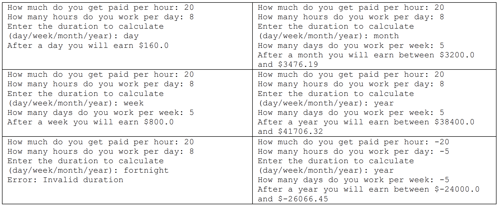

# Summary
Prompt the user for salary and working hours; calculate how much they will get
paid after a day, week, month, or year.

# Output
Below is a few examples of running the program with varied inputs.

